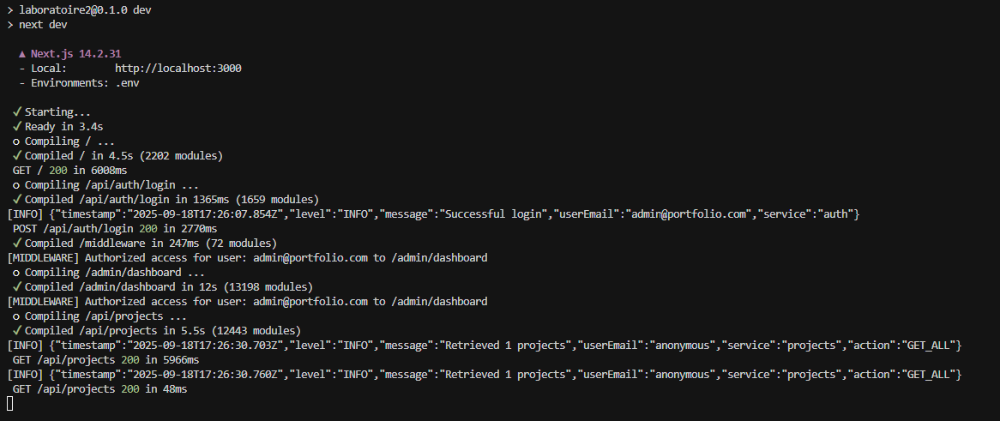
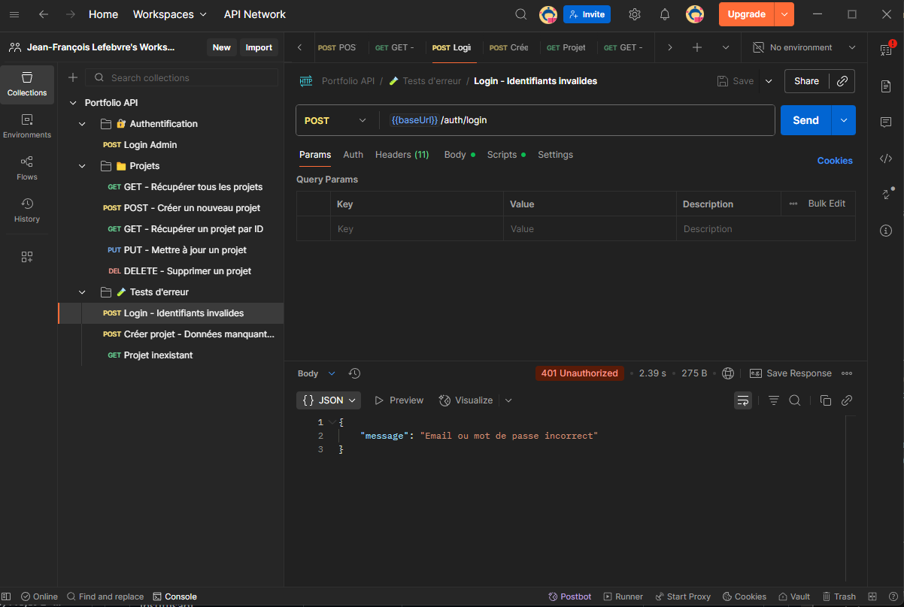
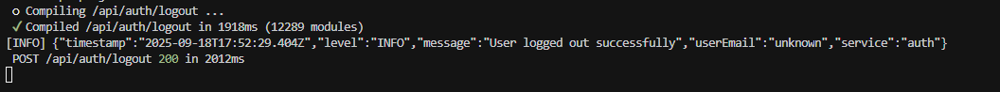
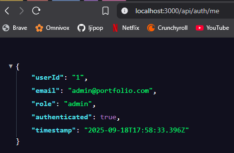
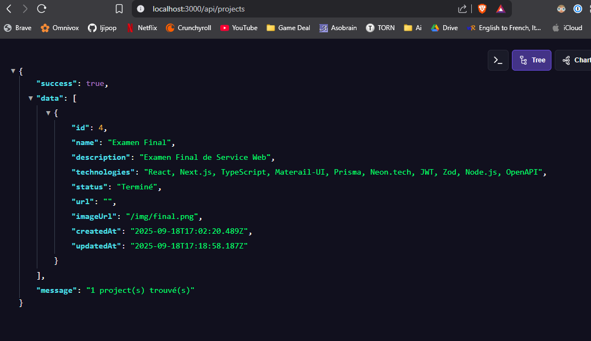
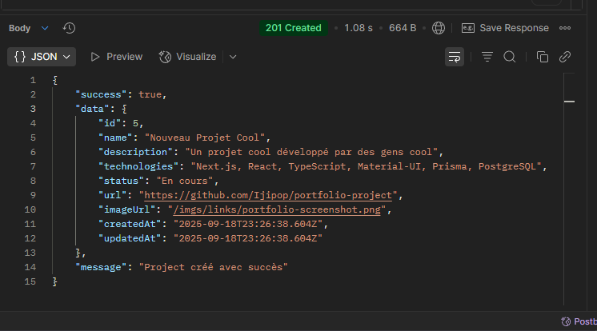
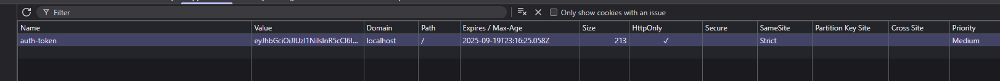

# 📸 Captures d'écran - Lab2 Authentification JWT

## Screenshot
Ce document contient toutes les captures d'écran nécessaires pour démontrer le bon fonctionnement de l'authentification JWT selon les exigences de l'examen.

---

## 1. Authentification & Sécurité

### 1.1 Login réussi
**Description** : Connexion admin avec logs de succès
**URL** : `http://localhost:3000`
**Logs attendus** : `[INFO] Successful login`



### 1.2 Middleware en action
**Description** : Logs du middleware autorisant l'accès
**Logs attendus** : `[MIDDLEWARE] Authorized access for user: admin@portfolio.com`

### 1.3 Erreur 401 - Accès sans authentification
**Description** : Tentative d'accès à une route protégée sans token
**URL** : `http://localhost:3000/api/projects` (sans cookie)
**Statut attendu** : 401 Unauthorized


### 1.4 Erreur 403 - Rôle insuffisant
**Description** : Tentative d'accès avec un rôle non-admin
**Statut attendu** : 403 Forbidden


### 1.5 Logout réussi
**Description** : Déconnexion avec logs de succès
**Logs attendus** : `[INFO] User logged out successfully`


---

## 2. API & Réponses JSON

### 2.1 Informations utilisateur
**URL** : `http://localhost:3000/api/auth/me`
**Réponse attendue** :
```json
{
  "userId": "1",
  "email": "admin@portfolio.com",
  "role": "admin",
  "authenticated": true,
  "timestamp": "2025-09-18T15:11:20.679Z"
}
```



### 2.2 Liste des projets
**URL** : `http://localhost:3000/api/projects`
**Réponse attendue** :
```json
{
  "success": true,
  "data": [...],
  "message": "X project(s) trouvé(s)"
}
```



### 2.3 Création de projet
**Méthode** : POST `/api/projects`
**Statut attendu** : 201 Created


---

## 3. Sécurité des Cookies

### 3.1 Cookies HttpOnly
**Où** : DevTools → Application → Cookies
**Vérifications** :
- ✅ `auth-token` présent
- ✅ `HttpOnly: true`
- ✅ `SameSite: Strict`



### 3.2 Headers de sécurité
**Où** : DevTools → Network → Headers
**Vérifications** :
- ✅ `Set-Cookie` avec attributs sécurisés
- ✅ Headers `x-user-email` et `x-user-role`

---

## 4. Documentation & Tests

### 4.1 Collection Postman
**Fichier** : `Portfolio-API.postman_collection.json`
**Vérifications** :
- ✅ Toutes les routes configurées
- ✅ Variables d'environnement
- ✅ Tests automatisés

### 4.2 Documentation OpenAPI
**Fichier** : `docs/openapi.yaml`
**Vérifications** :
- ✅ Endpoints documentés
- ✅ Schémas de validation
- ✅ Codes de statut HTTP

### 4.3 Tests automatisés
**Fichiers** : `tests/auth.test.js`, `tests/projects.test.js`
**Vérifications** :
- ✅ Tests de connexion
- ✅ Tests de protection des routes
- ✅ Tests de validation

---

## 5. Logs & Monitoring

### 5.1 Logs structurés
**Format** : JSON avec timestamp
**Exemple** :
```json
{
  "timestamp": "2025-09-18T15:11:20.679Z",
  "level": "INFO",
  "message": "Successful login",
  "userEmail": "admin@portfolio.com",
  "service": "auth"
}
```

### 5.2 Journal de tests
**Fichier** : `docs/TEST_LOG.md`
**Contenu** : Tableau des cas de test avec statuts

---

##  6. Validation des Exigences 

### ✅ Checklist Sécurité
- [ ] Contrôles d'accès côté serveur opérationnels
- [ ] Cookies : HttpOnly, Secure, SameSite
- [ ] JWT : exp, signature, secret en env
- [ ] Validation des entrées avec Zod
- [ ] Logs sans secrets, niveau INFO/ERROR
- [ ] .env.example complet, secrets non commit

### ✅ Plan de Tests
| Cas | Pré-conditions | Requête | Attendu |
|-----|----------------|---------|---------|
| Login valide | User existe | POST /api/auth/login | 200 + cookie |
| Login invalide | — | Id/Pwd faux | 401 |
| Accès protégé sans auth | — | GET /api/projects | 401 |
| Accès protégé rôle ok | Session admin | GET /api/projects | 200 |
| Logout | Session active | POST /api/auth/logout | 200 |

---

## 📝 Instructions pour les Captures

1. **Prenez les captures dans l'ordre indiqué**
2. **Incluez les logs de la console dans chaque capture**
3. **Montrez les codes de statut HTTP (200, 401, 403)**
4. **Vérifiez que les cookies sont bien HttpOnly**
5. **Démontrez le flux complet : login → accès → logout**

---

*Ce document accompagne le README principal et démontre visuellement le bon fonctionnement de l'authentification JWT selon les exigences du Lab2.*
